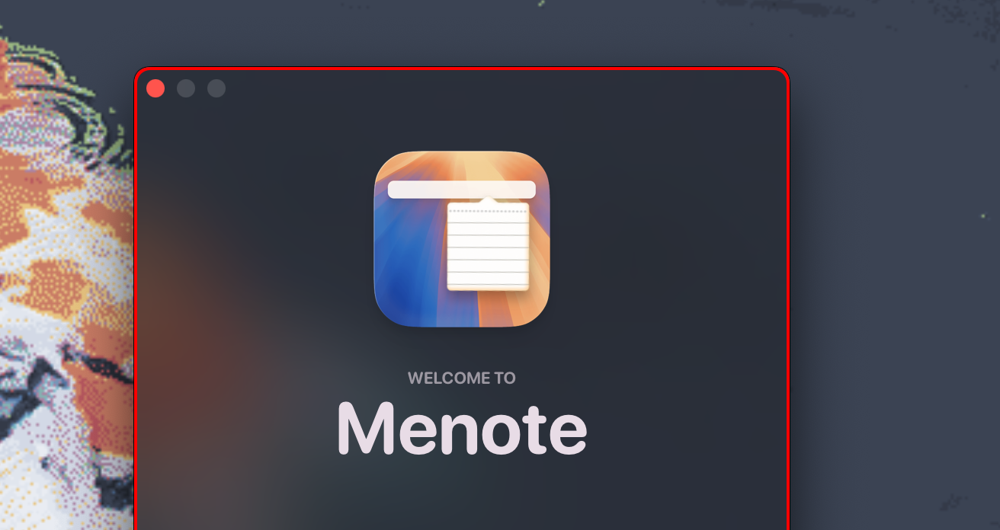
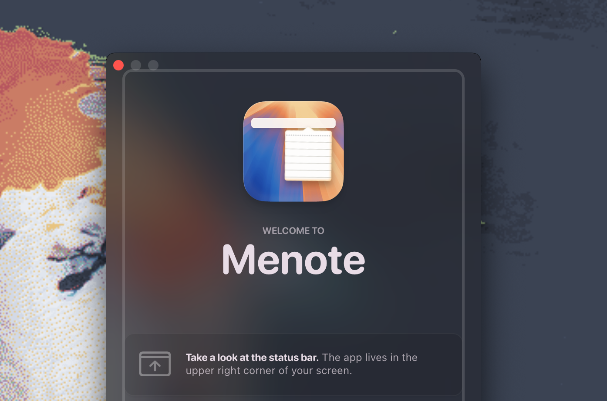

Add border around `WebviewWindow`.

### Install
_This lib requires a Rust version of at least **1.64**_

There are three general methods of installation that we can recommend.

1. Use crates.io and npm (easiest, and requires you to trust that our publishing pipeline worked)
2. Pull sources directly from Github using git tags / revision hashes (most secure)
3. Git submodule install this repo in your tauri project and then use file protocol to ingest the source (most secure, but inconvenient to use)

Install the Core plugin by adding the following to your `Cargo.toml` file:

`src-tauri/Cargo.toml`
```toml
[dependencies]
border = { git = "https://github.com/ahkohd/tauri-toolkit", branch = "v2" }
```
### Demo

> By default add a standard looking macOS border:


> Customise the color, thickness and corner radius:



> You can inset if need be:



> See an example project of a window with a border [here](https://github.com/ahkohd/tauri-macos-window-border-example)

## Usage
A basic usage:
```rust
use border::WebviewWindowExt as BorderWebviewWindowExt;

fn main() {
    let window = app_handle.get_webview_window("window_name");

    // Add border around the WebviewWindow.
    // You can pass your Some(BorderConfig), otherwise leave as None
    // to use default options.

    window.add_border(None);

    // Get access to the border
    // Useful if you want to update the border appearance dynamically

    let border = window.border().expect("Have you added a border?!");

    // For example, update the border color

    use tauri::window::Color;

    border.set_line_color(Color(255, 0, 0, 255));

    // Want to remove the border? 

    border.remove();
}
```

With your config:

```rust
use tauri::window::Color;
use border::{BorderConfig, WebviewWindowExt as BorderWebviewWindowExt};

fn main() {
    let window = app_handle.get_webview_window("window_name");

    window.add_border(Some(BorderConfig {
         line_width: 1.0,
         line_color: Color(255, 0, 0, 255),
         inset: 0.5,
         corner_radius: 10.0,
    }));
}
```

## BorderConfig Struct
Here is the description of the fields in this struct:

- `line_width`: _CGFloat_ representing the thickness of the border.
- `line_color`: _Color_ representing the color of the border.
- `inset`: _CGFloat_ defining the inset between the border and the window frame.
- `corner_radius`: _CGFloat_ defining the corner radius of the border.

## Functions
The `WebviewWindowExt` trait from the `border` crate when in scope adds the following methods to the `WebviewWindow`.

- `add_border(&self, config: Option<BorderConfig>)`:
  Adds a border view around the `WebviewWindow`. If options is `None`, the default options are used.
- `border(&self) -> Option<SharedId<BorderView>>`:
  Get the border view added around the `WebviewWindow`.
- `remove(&self)`:
  Remove the border view from the `WebviewWindow`.

## BorderView
The view that adds border around the `WebviewWindow`.

### Functions
- `set_line_color(&self, color: Color)`:
  Update the border's line color.
- `set_line_width(&self, width: CGFloat)`:
  Update the border line width.
- `set_inset(&self, inset: CGFloat)`:
  Update the inset.
- `set_corner_radius(&self, inset: CGFloat)`:
  Update the corner radius of the border.
- `set_accepts_first_mouse(&self, value: bool)`:
  Sets whether the border view should accept the first mouse click.
- `remove(&self)`:
  Remove the border view from the parent view.

You probably will not need to use the following methods, _they are used internally to setup the border view_:
- `set_frame(&self, frame: NSRect)`:
  Update the frame of the border.
- `set_parent(&self, ns_view: id)`:
  Update the parent of the border view.
- `set_auto_resizing(&self)`:
  Make the border view auto-resize along with the window's frame.
  _For convince, by default this is already called during the setup of the border view when you use the `window.add_border` API._


## Contributing

PRs accepted. Please make sure to read the Contributing Guide before making a pull request.

## License
MIT or MIT/Apache 2.0 where applicable

